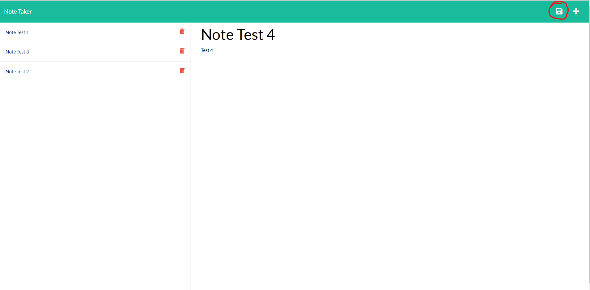
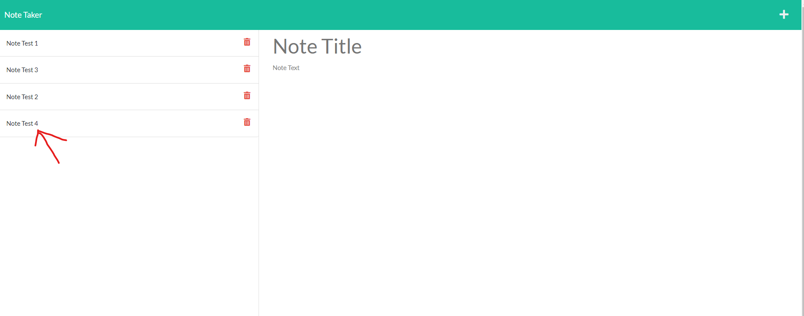
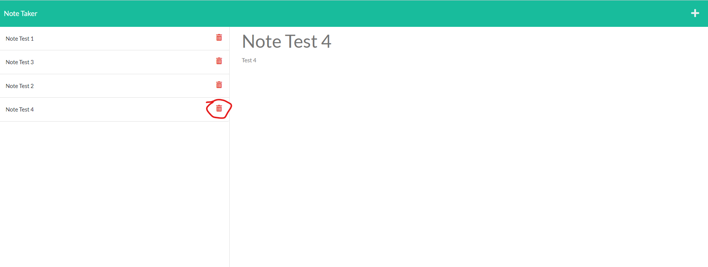

# Take Note

## Description

A note-taking web app. Store, retrieve, and delete notes from anywhere!

## Table of Contents

- [Take Note](#take-note)
  - [Description](#description)
  - [Table of Contents](#table-of-contents)
  - [Usage](#usage)
  - [Images](#images)
    - [Save Note](#save-note)
    - [Retrieve Note](#retrieve-note)
    - [Delete Note](#delete-note)
  - [Questions](#questions)

## Usage

To use this appliction: 
  1. enter a Note Title & Note Text
  2. Click the save icon that appears in the top-right corner
  3. You can then view the note by clicking on the Note Title you entered on the left.
  4. You can delete the note by clicking the 'trashcan' icon to the right of the Note Title.

## Images

### Save Note

### Retrieve Note

### Delete Note

## Questions

[My GitHub Profile](https://github.com/Deejerz88)

If you have any questions about my project, please contact me at [djmcmillan93@gmail.com](mailto:djmcmillan93@gmail.com).
